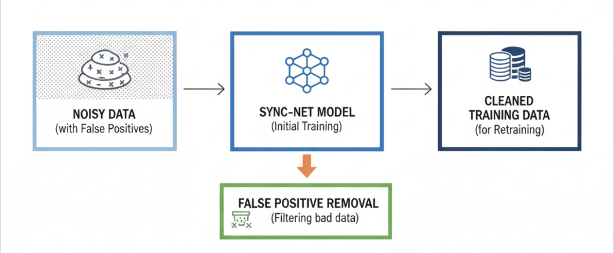
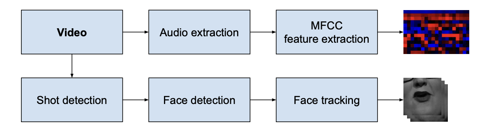
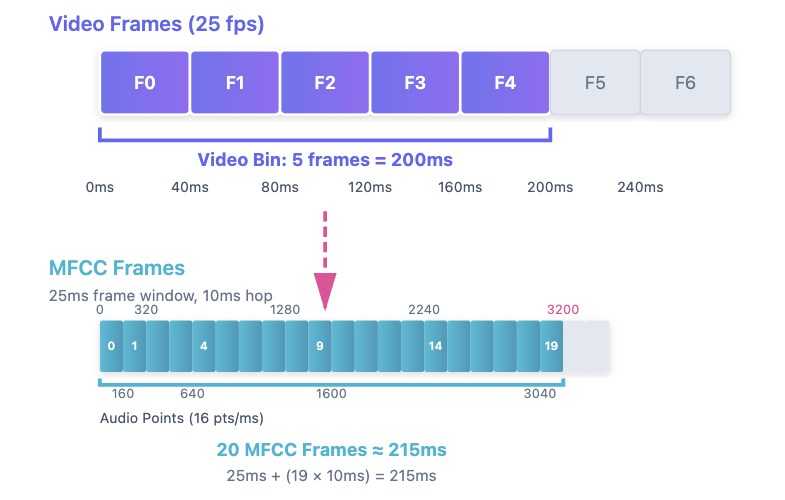

<!-- _paginate: false -->

# SyncNet 
## Out of Time: Automated Lip Sync in the Wild

**Aman Agrawal**

---

# Overview

This presentation provides a understanding of SyncNet by bridging research and implementation.

**Part 1: Research Paper Insights**
*Understanding the foundational concepts as presented in the original SyncNet research paper*
- Training data for SyncNet
- Refining the training data
- Audio-video data processing flow
- Audio & video processing pipeline
- SyncNet architecture
- Loss function

**Part 2: Implementation & Practical Application**
*From theory to practice: implementing and analyzing the SyncNet model*
- SyncNet inference pipeline
- Example walkthrough
- Details about training SyncNet
- Observation and conclusion on training efficiency analysis

---


# Training Data for SyncNet

## Source Dataset
Several hundred hours of speech from BBC videos (already lip-synced) were collected to train the model.

## Compiling the Training Data

| Pair Type | Generation Method |
|-----------|------------------|
| **Positive Pairs** | 5-frame video clip + corresponding audio (0.2s) |
| **Negative Pairs** | Same audio randomly shifted ±2 seconds |

<div align="center">


</div>

---

# Refining the Training Data

The training data generated using the proposed method is noisy in that it contains videos in which the voice and the mouth shapes do not correlate (e.g. dubbed videos) or are off-sync.

## Refinement Process

1. **Initial Training** - A network is initially trained on this noisy data

2. **Filtering** - The trained network is used to discard the false positives in the training set by rejecting positive pairs with distance over a threshold

3. **Retraining** - A network is then re-trained on this new cleaned data

This iterative refinement removes problematic samples and improves model quality.

<div align="center">

 
*Image Source: Generated by gemini (nano banana)*

</div>

---

# Audio-Video Data Processing Flow for SyncNet

- Audio Stream
- Video Stream

<div style="display: flex; gap: 20px; align-items: center;">
<div>


---

# Audio & Video Processing Pipeline

## Audio Stream
- **Input:** 0.2 seconds of audio
- **Feature Extraction:** MFCC (Mel-frequency cepstral coefficients)
- **Output:** 13×20 matrix - 13 mel frequency bands, 20 time steps (100Hz sampling rate × 0.2s)


## Video Stream  
- **Input:** 0.2 seconds of video at 25 fps
- **Processing:** Shot detection → Face detection → Face tracking
- **Output:** 111×111×5 tensor (W×H×T) - 5 grayscale frames of mouth region


*Figure 4: Pipeline to generate the audio-visual dataset*

---

# SyncNet Architecture 


---

# Loss Function

**Training Objective**
Goal is to make audio and video network outputs:
- **Similar** for genuine (synchronized) pairs → minimize distance
- **Different** for false (desynchronized) pairs → maximize distance

**Loss equation:**
E = 1/2N Σ(yn)d²n + (1-yn)max(margin-dn, 0)²
- **dn = ||vn - an||₂** : Euclidean distance between embeddings
- **v, a** : fc7 output vectors (256D) for video and audio streams
- **y ∈ [0,1]** : Binary label (1 = genuine pair, 0 = false pair)  
- **margin** : Minimum distance threshold for negative pairs

**Note**
Classification approach (sync/off-sync bins) was attempted but failed to converge. Contrastive loss proved more effective for this continuous synchronization problem.

---

# SyncNet Inference Pipeline

---

## Inference by SyncNet 

**Input Assumptions:** 25 FPS video, single speaker, no scene changes, face visible throughout

| **Stage** | **Operation** | **Details** |
|-----------|--------------|-------------|
| **1. Preprocessing** | Extract Frames & Audio | • Extract video frames → JPG images<br>• Convert audio → 16kHz mono WAV<br>|
| **2. Load & Convert** | Create Input Tensors | **Video :** Read frames → Stack → PyTorch tensor (1, T, C, H, W) = imvt <br>• T = total frames, C = 3 (RGB), H×W = frame dimensions<br><br>**Audio :** Load WAV → Extract MFCC → PyTorch tensor (1, 1, 13, T_audio) = cct <br>• MFCC params: 25ms window, 10ms hop<br>• 13 = MFCC coefficients, T_audio = number of MFCC frames |
| **3. Validation** | Length Check | • Verify: `audio_samples/16000 == frames/25`<br>• Compute: `min_length = min(frames, ⌊audio_samples/640⌋)`<br>• 640 samples/frame = 16kHz / 25 FPS |

---

| **Stage** | **Operation** | **Details** |
|-----------|--------------|-------------|
| **4. Feature Extraction** | A-V Embedding (0.2s chunks) |• lastframe = min_length-5<br>• Iterate for all possible video bins (5 frame chunk, 0.2s) with stride of 1, i.e [0-5, 1-6, 2-7...... min_length-lastframe], `a = [imtv[:,:,vframe:vframe+5,:,:] for vframe in range(0,last_frame)]`. <br>• Calculate the embedding for each video bin by passing each bin as input to video stream of syncnet model <br> • Have embeddings for each video bin -> (N x 1024); N -> Total number of bins<br><br>**Audio:** 20 MFCC frames → 2D CNN → 1024-D<br>•To map the current audio chunk to it's corresponding video bin the Indexing logic will be, `b = [cct[:,:,:,vframe * 4:vframe * 4+20] for vframe in range(0,last_frame)]` <br>• Why ×4 ?: T_audio/T = 4 (number of MFCC frames/Total frames in video) <br>• Why +20: This number is mathematically derived, with 25ms frame size for audio and 10ms hop length -> 25ms+(19×10ms) ≈ 215ms ≈ 200ms (5 video frames) which corresponds to the video bin<br>• Calculate the embedding for each audio bin by passing each bin as input to audio stream of syncnet model <br>• Have embeddings for each corresponding audio bin -> (N x 1024); N -> Total number of bins |

Note : This was just  for illustration purpose, while in inference we take optimal batch size like 20 and put the batch to gpu for faster inferencing, in example ahead we have taken into account the batch size for inference and processing via GPU.

---

# Why 20 MFCC frames are taken for 5 frame video bin (0.2 seconds) ?



---

# The visualization of first video bin (Frame 0 to Frame 4) and its corresponding 20 audio MFCCs (3440 audio points approx 200 ms)

## The 13x20 matrix input for audio stream of the syncnet model for its 0.2s video bin, 13 MFCC coefficients and 20 are number MFCC frames.

The below diagram answers the question why we do x4 for vframe and take3 20 MFCC frames for its 0.2s video bin


---

| **Stage** | **Operation** | **Details** |
|-----------|--------------|-------------|
| **5. Sync Calculation** | Distance Across Shifts | • Pad audio embeddings ±vshift frames (e.g., vshift=10)<br>• Test 21 windows: [-10, ..., 0, ..., +10] (2×vshift+1)<br>• Compute L2 distance for each shift<br>• Find minimum: `offset = vshift - argmin(distance)` |
| **6. Output** | Sync Metrics | • **Offset:** Audio ahead (+) or behind (-) in frames<br>• **Confidence:** `median(dist) - min(dist)`<br>• **Frame-wise confidence:** Per-frame sync quality |

---

## Example Walkthrough - Part 1: Extraction & Loading

**Sample Video:** 36 seconds, 900 frames @ 25 FPS, 224×224 resolution

| **Step** | **Input** | **Operation** | **Output** | **Shape** |
|----------|-----------|---------------|------------|-----------|
| **1. Extract** | Video file | • Extract frames → JPG<br>• Extract audio → 16kHz WAV | • 900 frames<br>• 575,616 audio samples | Frames: 900<br>Audio: (575616,) |
| **2. Load** | Frames + Audio | • Stack frames → `imtv` tensor<br>• Extract MFCC → `cct` tensor | Video: `imtv`<br>Audio: `cct` | `(1, 3, 900, 224, 224)`<br>`(1, 1, 13, 3597)` |
| **3. Validate** | Duration check | • Video: 900/25 = 36.0s<br>• Audio: 575616/16000 = 35.98s<br>• `min_length = min(900, ⌊575616/640⌋)` | `min_length = 899`<br>`lastframe = 894` | ⚠️ Slight mismatch: 0.02s |

**Key Observations:**
- T (video) = 900 frames, T_audio (MFCC) = 3597 frames
- Ratio: 3597 / 900 ≈ 4 (MFCC hop 10ms vs video 40ms/frame @ 25 FPS)
- Will process 894 windows (0.2s chunks)

---

## Example Walkthrough - Part 2: Feature Extraction

**Batch Processing:** 894 windows in 45 batches (batch_size=20)

| **Component** | **Indexing Logic** | **Batch Dimensions** | **Example (vframe=0)** |
|---------------|-------------------|----------------------|------------------------|
| **Video Input** | `imtv[:,:,vframe:vframe+5,:,:]` | `(20, 3, 5, 224, 224)` | Frames 0→4<br>Slice: `[0:5]` |
| **Audio Input** | `cct[:,:,:,vframe×4:vframe×4+20]` | `(20, 1, 13, 20)` | MFCC 0→19<br>Slice: `[0:20]` |
| **3D CNN (Video)** | 5 frames → Conv3D layers | → `(20, 512)` flatten | → FC layers |
| **2D CNN (Audio)** | 20 MFCC frames → Conv2D | → `(20, 512)` flatten | → FC layers |
| **Embeddings** | After FC (512→1024) | `(20, 1024)` per batch | 1024-D vectors |

**After All Batches:**
- Video embeddings: `(894, 1024)`
- Audio embeddings: `(894, 1024)`

---

## Example Walkthrough - Part 3: Sync Calculation & Output

| **Step** | **Processing** | **Dimensions** | **Result** |
|----------|----------------|----------------|------------|
| **Padding** | Pad audio embeddings ±vshift | For vshift=10:<br>`(894+20, 1024)` | Audio padded to `(914, 1024)` |
| **Window Creation** | Create 21 shifted versions | 21 windows: [-10 to +10] | Each window: `(894, 1024)` |
| **Distance Calc** | For each video frame:<br>• Compare with 21 audio shifts<br>• L2 distance | Distance matrix:<br>`(894, 21)` | 894 frames × 21 shifts |
| **Mean Distance** | Average across all 894 frames | `(21,)` vector | 21 mean distance values |
| **Find Minimum** | `argmin` of mean distances | Scalar index | e.g., argmin = 7 |
| **Compute Offset** | `offset = vshift - argmin` | Scalar | 10 - 7 = **+3 frames**<br>|
| **Confidence** | `median(distances) - min(distance)` | Scalar | e.g., **8.5** (high confidence) |

**Final Output:**
- **AV Offset:** +3 frames (audio 120ms ahead)
- **Confidence:** 8.5 (reliable sync detection)
- **Frame-wise Confidence:** Array shape `(894,)` with per-frame quality scores

---

## Details about training syncNet 

 - Batch size = 1024, Epochs = 300 (Total samples (positive + negative) per epoch : 15360), 15 step per epoch, total steps = 4500.
 - Train, val and test split is 80:10:10 (3261, 407 and 409 clips) (5 sample per clip)
 - Time taken to complete training - 3 Hours 15 Mins, validation pass is run after every 5th epoch
 - Time Taken by Train only epoch - 30s
 - Time Taken by Train + Val epoch - 45s 
 - Theoritical train time (60 Train + Val epochs = 45x60s = 2700s, 240 Train epochs = 30x240s = 7200s) totals to 2 Hr 45 Mins. 
- Every process's time for every step of every epoch was tracked. Analysis and conclusion is made by analysing all the tracking data and logs of the training run (after 1 slide)

----

**How the data is stored?**
```yaml
syncnet_data/
  train/
    video1/
      - audio.wav
      - audio.npy   # Shape: (Total_bins, 1, 13, 20), this is cct vector with reference from above (conversion step)
      - frames/
          - frame0.jpg
          - frame1.jpg
          - ...
          - frameXX.jpg
    video2/
    ...
  val/
    [same structure as train]
  test/
    [same structure as train]
```
---

# Observation and Conclusion on analysis done to track time for every process involved for every train step of every epoch

Time is tracked for each process involved in the training pipeline - data loading, forward pass, loss calculation, backward pass and weights update, and this too for every step (every batch) of every epoch. After analyzing the timing logs across multiple epochs, a clear bottleneck has emerged that's severely impacting the training efficiency.
Every train-only epoch takes around 30-35 seconds to complete, but here's the problem - the first step of each epoch takes 80-90% of the total time (18-27 seconds), which is the main bottleneck. The rest of the steps get completed in just 3-4 seconds total. Each step after the first one consistently takes around 0.21 seconds (**Step Performance:** Once loaded, steps run at ~4,920 samples/sec (0.21s per 1024-sample batch)), so for 15 steps that's roughly 3 seconds. This means the actual model computation (forward pass, backward pass, loss calculation, weight updates) only takes about 3 seconds for all the steps of an epoch, while the remaining 27 seconds are wasted on dataloader initialization in the first step.
Validation is run after every 5 epochs, and these train+validation epochs take around 45 seconds total - 30 seconds for training (with the same bottleneck issue) plus an additional 15 seconds for validation. The validation phase has similar issues with dataloader initialization taking most of the time rather than actual forward pass computation.  
This thing is clearly evident from the logs : **Full Training Logs:** [View on WandB](https://wandb.ai/iv-dev/syncnet_profiling/runs/tcu0s63r/logs)

**Wan dB Charts** [WandB Charts: syncnet_bs1024_w64](https://wandb.ai/iv-dev/syncnet_profiling?nw=nwuserivdev)

---